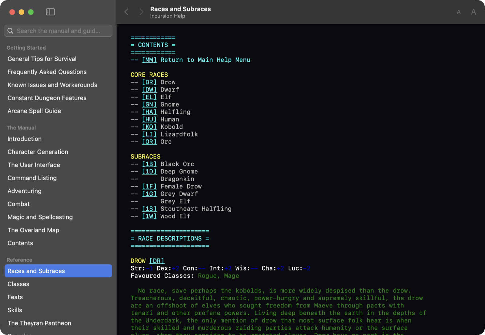

# The help window

The native Mac app has a help window of its own: **Help → Incursion Help**, or
⌘?. It holds two things that have never been in one place before — the game's
own manual, and the player guides from the Incursion Wiki.

| Part | Where it comes from | Built when | Licence |
|---|---|---|---|
| Manual and reference | the engine, `incursion -exporthelp` | every app build | Incursion licence + OGL |
| Getting Started guides | `tools/fetch_wiki_help.py`, run by hand | vendored in the repo | CC BY-SA 3.0 |
| About This Help | written in `HelpWindow.swift` | — | this project |



```
./incursion -exporthelp macapp/Resources/Help/manual.json   # the manual
python3 tools/fetch_wiki_help.py                            # refresh guides
python3 tools/fetch_wiki_help.py --check                    # are they stale?
tools/check_help.sh                                         # the gate
LIVE=yes tools/check_help.sh                                # ...and open it
```

## Why the manual is exported and not written

Half of the manual is prose in `lib/help.irh`. The other half does not exist
until a module is loaded: the race, class, feat, skill, domain and spell pages
are generated from the ruleset by `src/Help.cpp`, which is why the in-game
help can list exactly the feats this build has.

A help file written alongside the game would therefore be wrong the first time
anyone changed the ruleset, and wrong silently. `Game::WriteHelpExport()` calls
the same `GetHelp()` the in-game viewer calls, for every topic, and writes one
JSON document. `macapp/build_app.sh` runs it straight after compiling the
module, so the shipped manual describes the shipped ruleset by construction.

The document is a list of runs — a colour index and a string, or a link, or an
anchor. That decoding of the engine's text markup happens in the engine, which
owns it, rather than in Swift, which would be a second copy of a private
format. `WriteHTMLHelp()` still exists and still writes the old HTML manual;
it encodes each of the sixteen colours as a different depth of nested `<b>`,
which no reader can undo, so the window does not use it.

**Every reachable topic is exported, not just the contents list.** Pages link
to topics a contents list would not carry — `alchemy` from the powers page,
a description for every skill — and the exporter follows those links until
nothing new resolves. Three targets in the base data resolve to nothing at
all (`custom`, which needs a live character, and `poisons` and `psionics`,
which were never written); the window draws those as plain text rather than
as links that go nowhere, and `tools/check_help.sh` fails if a fourth appears.

## Why the wiki pages are vendored, and which ones

The wiki has two kinds of page. One kind restates the game's data — every
monster, every spell, every item. The app takes none of those: it generates
that reference from the module the player is running, so a wiki copy could
only be a second, staler answer. The other kind is the writing the game has
none of: what to do first, what kills new characters, which spells earn a
slot. That is what is taken.

Five pages, listed in `tools/fetch_wiki_help.py`. Two obvious candidates were
looked at and rejected — `start` and `strategy-guide` are link indexes, and
vendored they would be a page of dead ends in an app that may be offline.

The files are checked into the repository rather than fetched during a build.
A build that reaches the internet fails on a train, and a page that changed
upstream should change in a commit somebody can read, not silently between two
builds of the same source. `--check` re-fetches and reports staleness.

## The licence, and how it is met

Wiki content is under [CC BY-SA 3.0](https://creativecommons.org/licenses/by-sa/3.0/).
Three obligations follow.

**Attribution.** Each vendored file carries the page title, its URL, the
authors as "Incursion Wiki contributors", the retrieval date and the licence.
The help window prints all of it in a band above the page, with a link to the
original and a link to the licence — where a reader sees it, not in a credits
file nobody opens. `tools/check_help.sh` fails if any field is missing.

**Statement of changes.** The only change is the conversion from the site's
HTML to Markdown, and each file says so. The tool does not rewrite, summarise
or reorder: a guide edited by a third party is no longer the guide the wiki
vouches for, and the licence would require saying so.

**ShareAlike.** The vendored pages stay CC BY-SA 3.0 and say so. They are
separate documents that the application displays, not code linked into it, so
this is aggregation and not a derivative work of the engine — the project's
own MIT and OGL terms are unaffected, and the wiki's licence does not reach
them. `tools/gen_app_licenses.sh` puts the same statement in the bundle's
Licenses and Notices document.

## Why not the macOS Help Book

Apple's help viewer wants an indexed bundle of HTML prepared ahead of time.
Half of this manual does not exist ahead of time. It also expects one document
per app, where this shows two sources under different licences that have to be
told apart on screen, and it opens a separate application the player cannot
arrange beside the game. The window is a few hundred lines of AppKit and
SwiftUI and does all three.

## How the window is put together

| File | What it does |
|---|---|
| `HelpContent.swift` | loads `manual.json` and the vendored Markdown; sidebar sections; search |
| `HelpRender.swift` | manual runs and Markdown to `NSAttributedString`; the palette |
| `HelpTextView.swift` | the reading pane: an `NSTextView` with links, Find and selection |
| `HelpWindow.swift` | the window, sidebar, history, and the About page |

The reading pane is TextKit and not a SwiftUI `Text`, for three reasons that
each rule the alternative out: a reference page is a megabyte of text, an
anchor needs a character offset to scroll to, and Find, selection and copy
should behave the way they do everywhere else on the Mac.

The manual is laid out at **exactly eighty monospaced columns**, because that
is the width its boxes and tables are aligned for; the in-game viewer wraps
its prose to the window, so wrapping at eighty matches what a player sees. The
wiki pages are prose and are re-wrapped at a comfortable measure in the system
font. Both use the game's own palette on a dark ground, so a colour means the
same here as on the map — and the View menu's Soft Palette setting reaches
this window too, which is the answer the wiki's own FAQ gives to "the coloured
text is hard to read".

Anchors — the `{DR}` markers a reference page puts in its contents list and
again at the entry — are drawn as links only where the same marker appears
twice. A marker that appears once is a pure jump target for the in-game
keyboard, and drawing it would put `[A]` in the middle of a sentence.

`INCURSION_OPEN_HELP=<topic>` opens the window at launch, and accepts
`races#KO` to land on an anchor and a wiki slug as well; `INCURSION_HELP_QUERY`
prefills the search. Both exist so the window can be exercised and photographed
without a mouse, and `LIVE=yes tools/check_help.sh` uses the first.
